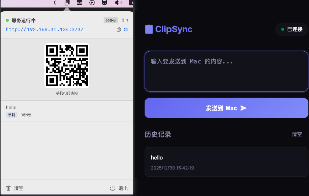

# ClipSync

局域网跨设备剪贴板同步工具 - 安卓手机 → macOS

目前 PC 端没有好用的语音输入法，而跑本地跑 Whisper 相当耗资源，大多数的电脑都扛不住。移动端的豆包输入法和微信输入法的大模型识别效果还不错，借助于本工具可以使用他们来进行语音输入，这里推荐豆包输入

## 截图



## 功能特点

- 📋 **macOS 状态栏应用**，轻量无干扰，无 Dock 图标
- 📱 **安卓端 PWA 网页**，无需安装 App，浏览器直接访问
- ⚡ **WebSocket 实时同步**，毫秒级响应
- 🔒 **局域网内通信**，安全私密，数据不出本地网络
- 💾 **历史记录**，自动保存最近 20 条，点击即复制
- ⌨️ **全局快捷键**，`Option + 空格` 快速打开面板, **同时默认复制最新的一条，我们只需要直接 Ctrl+v 就行**
- 📷 **二维码扫码**，手机扫一扫即可访问，无需手动输入

## 快速开始

### 1. 编译运行

**方式一：使用 Xcode（推荐）**

1. 双击打开 `ClipSync.xcodeproj`
2. 按 `⌘R` 运行
3. 状态栏出现 📋 图标即表示成功

**方式二：命令行编译**

```bash
# 需要安装完整的 Xcode
cd ClipSync
xcodebuild -scheme ClipSync -configuration Release build

# 编译后的 app 在 build/Release/ClipSync.app
```

### 2. 安卓端使用

1. 点击 macOS 状态栏的 📋 图标
2. 查看访问地址（如 `http://192.168.1.100:3737`）
3. 确保安卓手机和 Mac 在**同一 WiFi 网络**
4. 手机浏览器打开该地址
5. 输入文字，点击发送

### 3. macOS 端复制

- 点击状态栏 📋 图标
- 点击任意消息即可复制到剪贴板
- 支持悬停显示操作按钮

## 生成可分发 App

1. Xcode 菜单：**Product → Archive**
2. 在 Organizer 中点击 **Distribute App**
3. 选择 **Copy App** 导出到本地

或者直接从 Build 目录复制：

```
~/Library/Developer/Xcode/DerivedData/ClipSync-xxx/Build/Products/Release/ClipSync.app
```

## 项目结构

```
ClipSync/
├── ClipSync.xcodeproj          # Xcode 项目文件
└── ClipSync/
    ├── ClipSyncApp.swift       # 应用入口，状态栏配置
    ├── Models/
    │   └── ClipboardItem.swift # 数据模型
    ├── Views/
    │   └── MenuBarView.swift   # 状态栏弹出界面
    ├── Services/
    │   └── ServerManager.swift # HTTP + WebSocket 服务器
    ├── Assets.xcassets/        # 资源文件
    ├── Info.plist              # 应用配置
    └── ClipSync.entitlements   # 权限配置
```

## 技术栈

| 组件     | 技术                                 |
| -------- | ------------------------------------ |
| macOS 端 | SwiftUI + AppKit + Network.framework |
| 安卓端   | HTML + CSS + JavaScript (PWA)        |
| 通信协议 | HTTP + WebSocket                     |
| 端口     | 3737（HTTP 和 WebSocket 共用）       |

## 系统要求

- **macOS**: 13.0 (Ventura) 或更高版本
- **安卓**: 任意现代浏览器（Chrome、Edge、Firefox 等）
- **网络**: 设备需在同一局域网内

## 常见问题

**Q: 安卓无法连接？**

- 确保手机和 Mac 在同一 WiFi
- 检查 Mac 防火墙设置，允许入站连接
- 首次运行时点击"允许"网络权限提示
- 确保 WiFi 没有设置客户端隔离。

**Q: 如何开机自动启动？**

- 系统偏好设置 → 用户与群组 → 登录项 → 添加 ClipSync.app

**Q: 如何更换端口？**

- 修改 `ClipSyncApp.swift` 中的 `port: 3737` 参数

## License

MIT
